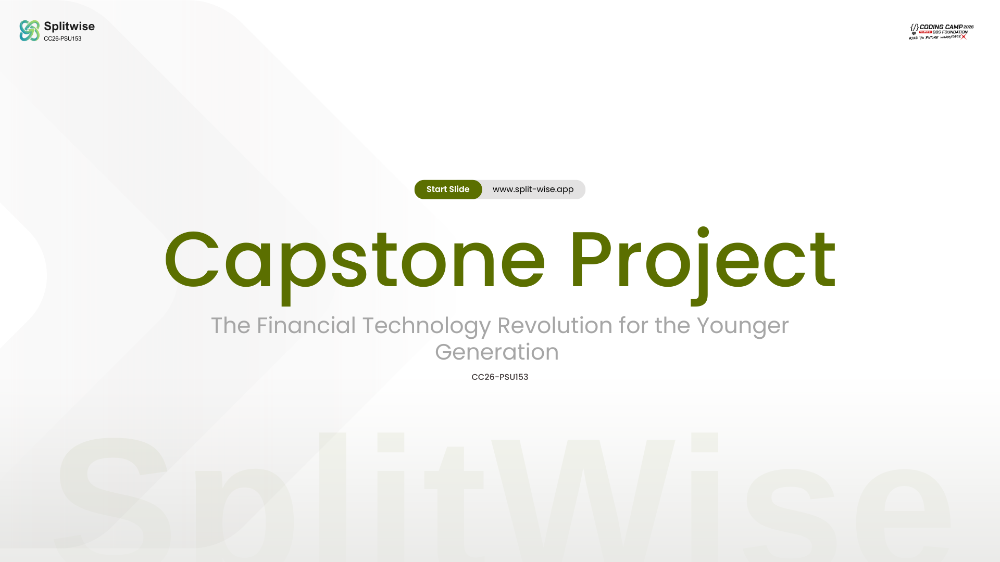
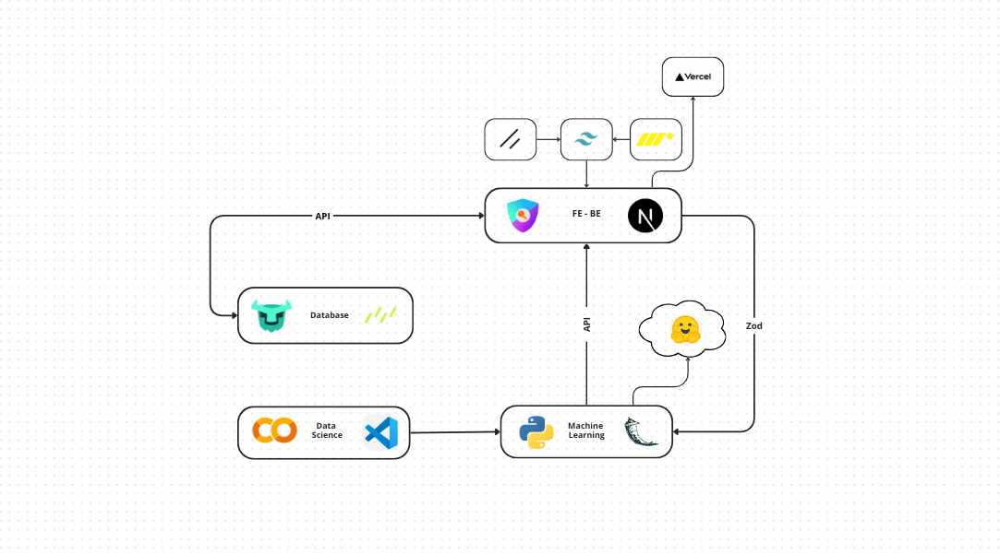

  
  
  # Splitwise
  
  **The Financial Technology Revolution for the Younger Generation**
  
  

    <a href="#features">Features</a> •
    <a href="#technical-features">Technical</a> •
    <a href="#team">Team</a> •
    <a href="#app-architecture">Architecture</a> •
  

  

---

## 📖 Tentang SplitWise

**SplitWise** adalah aplikasi *Smart Financial Management* berbasis *web* yang dirancang khusus untuk membantu Generasi Z dan Milenial mengambil alih kendali atas keuangan mereka. 

Di era di mana jebakan *lifestyle inflation* dan pinjaman berisiko tinggi semakin marak, sekadar mencatat pengeluaran saja tidak cukup. SplitWise hadir mengintegrasikan antarmuka yang modern dengan kecerdasan buatan (AI) dan analitik data mendalam. Aplikasi ini bertindak sebagai penasihat keuangan pribadi Anda: melacak arus kas, mengaudit anggaran secara otomatis, memberikan peringatan dini terhadap kebiasaan boros, dan memandu Anda menuju kemerdekaan finansial melalui investasi.

---

<h2 id="features">Fitur Unggulan</h2>

### 1. Dasbor Keuangan Interaktif
Pantau seluruh arus kas Anda dalam satu layar yang bersih dan modern. Visualisasi data yang dinamis memudahkan Anda melihat ke mana perginya uang Anda setiap bulan mulai dari kebutuhan pokok, gaya hidup, hingga beban cicilan semua disajikan dalam grafik yang mudah dipahami tanpa perlu menjadi ahli finansial.

### 2. Audit Kesehatan Finansial Berbasis AI
Selamat tinggal tebak-tebakan! Cukup masukkan profil pendapatan, pengeluaran, dan tanggungan Anda, dan biarkan algoritma *Machine Learning* kami yang bekerja. Sistem akan menganalisis profil Anda dan memberikan skor kesehatan finansial yang akurat (Kategori: **Good, Average,** atau **Bad**) berdasarkan rasio tabungan dan beban utang.

### 3. Smart Budgeting & Auto-Warning
Merasa pengeluaran gaya hidup sering bocor? Fitur *Smart Budgeting* bertindak sebagai rem darurat Anda. Sistem secara pintar akan mengevaluasi batas anggaran Anda dan merancang strategi penyelamatan (*rescue plan*) untuk mengubah status keuangan yang defisit kembali menjadi stabil dan memiliki tabungan positif.

### 4. Rekomendasi Investasi Personal
Uang Anda tidak seharusnya diam. Bagi pengguna yang telah mencapai indikator keuangan sehat (kategori *Good*), SplitWise akan membuka kunci fitur investasi. Sistem akan merekomendasikan instrumen investasi yang paling sesuai dengan profil risiko Anda agar aset Anda dapat terus bertumbuh.

<h2 id="technical-features">Fitur Teknis & Pengalaman Pengguna (UX)</h2>

Selain keunggulan analitik, SplitWise dibangun dengan memperhatikan skalabilitas dan kenyamanan pengguna:

### 1. Multi-Language Support
Aplikasi ini mendukung pelokalan (*localization*) untuk menjangkau audiens yang lebih luas. Pengguna dapat dengan mudah beralih bahasa tanpa memuat ulang (*reload*) halaman.
- 🇮🇩 Bahasa Indonesia
- 🇬🇧 English
- 🇨🇳 Mandarin (Chinese)

### 2. Dark/Light Mode Toggle
Didesain untuk kenyamanan mata pengguna dalam berbagai kondisi pencahayaan. SplitWise dilengkapi dengan fitur peralihan tema (*Dark Mode* / *Light Mode*) yang responsif dan otomatis menyimpan preferensi tampilan pengguna.

### 3. Secure Authentication (Login/Register)
Sistem autentikasi yang aman untuk memastikan privasi data finansial setiap pengguna tetap terjaga. Setiap pengguna memiliki dasbor dan riwayat analitiknya masing-masing.

### 4. Fully Responsive Design
Antarmuka dibangun secara responsif sehingga tampilan *dashboard* maupun *chart* analitik tetap terlihat sempurna dan interaktif, baik saat diakses melalui *Desktop*, *Tablet*, maupun *Smartphone*.

## App Architecture

  
  
  *Arsitektur sistem splitwise menunjukkan flow data dari frontend ke backend dengan integrasi AI/ML models*

---

### Team Members

| Name | Student ID | Role | Connect |
|------|------------|------|---------|
| **Dzikri Raihan** | CDCC288D6Y1130 | Data Science | [LinkedIn](https://www.linkedin.com) |
| **Auliya A** | CDCC117D6X2664 | Data Science | [LinkedIn](https://www.linkedin.com) |
| **Nisa Amelia** | CACC001D6X2192 | Machine Learning | [LinkedIn](https://www.linkedin.com) |
| **Felicia** | CACC001D6X1722 | Machine Learning | [LinkedIn](https://www.linkedin.com) |
| **Novendy F** | CFCC904D6Y1696 | Fullstack Developer | [LinkedIn](https://www.linkedin.com) |
| **Rahmatullah** | cfcc155d6y0768 | Fullsatck Developer | [LinkedIn](https://www.linkedin.com) |

  
⭐ **Star this repository if SPLITWISE helps your budget!** ⭐

[⬆ Back to Top](#splitwise)

